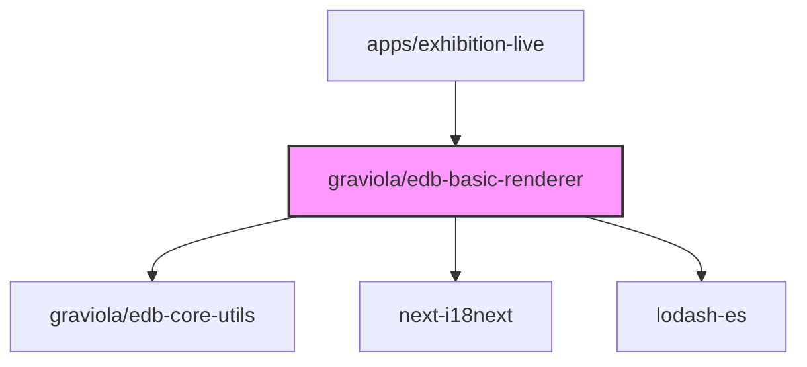

# @graviola/edb-basic-renderer

A collection of essential form renderers for JSON Forms, built with Material UI components for the Graviola framework.


## Overview

This package provides a set of React components that render various form controls for JSON Forms. These renderers are designed to work with the JSON Forms library and Material UI to create rich, interactive forms for editing JSON data. The renderers in this package handle common form elements like images, enums, booleans, dates, and special fields like `@id` and `@type` that are used in JSON-LD.

## Ecosystem Integration

### Position in the Graviola Framework

The basic-renderer package is a core UI component in the Graviola framework's form rendering system. It provides the fundamental building blocks for creating forms that can edit and display linked data. It works alongside other form renderer packages to provide a complete form editing experience.

### Dependency Graph



### Package Relationships

- **Dependencies**:

  - `@graviola/edb-core-utils`: Provides utility functions used by the renderers
  - `next-i18next`: Used for internationalization of labels and messages
  - `lodash-es`: Provides utility functions for object manipulation

- **Peer Dependencies**:

  - `@graviola/edb-state-hooks`: For state management
  - `@mui/material`, `@mui/icons-material`, `@mui/x-date-pickers`: Material UI components
  - `@jsonforms/material-renderers`, `@jsonforms/core`, `@jsonforms/react`: JSON Forms library
  - `react`: React library

- **Used By**:
  - `apps/exhibition-live`: Uses the renderers in its form configuration

## Installation

```bash
npm install @graviola/edb-basic-renderer
# or
yarn add @graviola/edb-basic-renderer
# or
bun add @graviola/edb-basic-renderer
```

## Features

- **ImageRenderer**: Renders an image preview with an edit button to change the image URL
- **EnumRenderer**: Renders enum values as radio buttons
- **TypeOfRenderer**: Specialized renderer for `@type` fields in JSON-LD
- **MaterialBooleanControlRenderer**: Renders boolean values as checkboxes with three-state support
- **MaterialDateRenderer**: Renders date inputs with Material UI date pickers
- **AutoIdentifierRenderer**: Specialized renderer for `@id` fields in JSON-LD
- **Special Date Renderers**: Specialized renderers for handling date formats specific to the Graviola framework

## Usage

To use these renderers, you need to register them with the JSON Forms renderer registry:

```typescript
import {
  ImageRenderer,
  EnumRenderer,
  TypeOfRenderer,
  MaterialBooleanControlRenderer,
  materialBooleanControlTester,
  MaterialDateRenderer,
  materialDateRendererTester,
  AutoIdentifierRenderer,
  AdbSpecialDateRenderer,
  adbSpecialDateControlTester
} from '@graviola/edb-basic-renderer';
import { JsonFormsRendererRegistryEntry, rankWith, scopeEndsWith } from '@jsonforms/core';

// Create a renderer registry
const renderers: JsonFormsRendererRegistryEntry[] = [
  // Register the ImageRenderer for fields that end with 'image'
  {
    tester: rankWith(10, scopeEndsWith('image')),
    renderer: ImageRenderer
  },
  // Register the AutoIdentifierRenderer for @id fields
  {
    tester: rankWith(10, scopeEndsWith('@id')),
    renderer: AutoIdentifierRenderer
  },
  // Register the TypeOfRenderer for @type fields
  {
    tester: rankWith(10, scopeEndsWith('@type')),
    renderer: TypeOfRenderer
  },
  // Register the MaterialBooleanControlRenderer
  {
    tester: materialBooleanControlTester,
    renderer: MaterialBooleanControlRenderer
  },
  // Register the MaterialDateRenderer
  {
    tester: materialDateRendererTester,
    renderer: MaterialDateRenderer
  },
  // Register the AdbSpecialDateRenderer
  {
    tester: adbSpecialDateControlTester,
    renderer: AdbSpecialDateRenderer
  }
];

// Use the renderers with JsonForms
import { JsonForms } from '@jsonforms/react';

const MyForm = ({ data, schema, uischema, onChange }) => (
  <JsonForms
    data={data}
    schema={schema}
    uischema={uischema}
    renderers={renderers}
    onChange={onChange}
  />
);
```

## Internal Usage

This package is used in the Graviola framework to render form fields in applications like the exhibition-live app. Here's an example from the rendererRegistry.ts file:

```typescript
// From apps/exhibition-live/components/config/rendererRegistry.ts
import {
  adbSpecialDateControlTester,
  AdbSpecialDateRenderer,
  AutoIdentifierRenderer,
  ImageRenderer,
  materialBooleanControlTester,
  TypeOfRenderer,
} from "@graviola/edb-basic-renderer";

export const rendererRegistry: JsonFormsRendererRegistryEntry[] = [
  ...materialRenderers,
  {
    tester: rankWith(10, scopeEndsWith("image")),
    renderer: ImageRenderer,
  },
  {
    tester: rankWith(10, scopeEndsWith("@id")),
    renderer: AutoIdentifierRenderer,
  },
  {
    tester: rankWith(10, scopeEndsWith("@type")),
    renderer: TypeOfRenderer,
  },
  // ... other renderers
  {
    tester: adbSpecialDateControlTester,
    renderer: AdbSpecialDateRenderer,
  },
  {
    tester: materialBooleanControlTester,
    renderer: MaterialBooleanControl,
  },
];
```

## API Reference

### ImageRenderer

Renders an image preview with an edit button to change the image URL.

### EnumRenderer

Renders enum values as radio buttons in a horizontal layout.

### TypeOfRenderer

Specialized renderer for `@type` fields in JSON-LD.

### MaterialBooleanControlRenderer

Renders boolean values as checkboxes with three-state support (true, false, undefined).

### MaterialDateRenderer

Renders date inputs with Material UI date pickers.

### AutoIdentifierRenderer

Specialized renderer for `@id` fields in JSON-LD.

### AdbSpecialDateRenderer

Specialized renderer for handling date formats specific to the Graviola framework.

## License

This package is part of the Graviola project.
