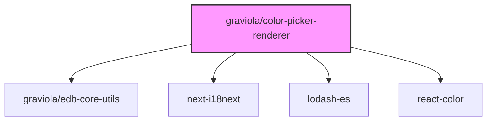

# @graviola/color-picker-renderer

A collection of color picker renderers for JSON Forms, providing intuitive color selection and formatting in the Graviola framework.


## Overview

This package provides React components for rendering color picker controls in JSON Forms. It includes simple and advanced color picker renderers with support for various color formats (hex, rgb, rgba, hsl, hsla). The renderers use the react-color library to provide intuitive color selection interfaces.

## Ecosystem Integration

### Position in the Graviola Framework

The color-picker-renderer package extends the form rendering capabilities of the Graviola framework by providing specialized components for color selection. It works alongside other form renderer packages to create rich, interactive forms for editing JSON data with color properties.

### Dependency Graph



### Package Relationships

- **Dependencies**:

  - `@graviola/edb-core-utils`: Provides utility functions used by the renderers
  - `next-i18next`: Used for internationalization of labels and messages
  - `lodash-es`: Provides utility functions for object manipulation
  - `react-color`: Provides the color picker components

- **Peer Dependencies**:
  - `@graviola/edb-state-hooks`: For state management
  - `@mui/material`, `@mui/icons-material`, `@mui/x-date-pickers`: Material UI components
  - `@jsonforms/material-renderers`, `@jsonforms/core`, `@jsonforms/react`: JSON Forms library
  - `react`: React library

## Installation

```bash
bun add @graviola/color-picker-renderer
# or
npm install @graviola/color-picker-renderer
# or
yarn add @graviola/color-picker-renderer
```

## Features

- **ColorPickerRenderer**: A simple color picker with a color preview and text input
- **AdvancedColorPickerRenderer**: An advanced color picker with configurable picker types and additional features
- **Color Format Support**: Support for hex, rgb, rgba, hsl, and hsla color formats
- **Ajv Integration**: Custom format validators for color formats to use with Ajv
- **Multiple Picker Types**: Support for various picker types from react-color (sketch, chrome, block, etc.)

## Usage

### Basic Usage

To use the color picker renderers, register them with the JSON Forms renderer registry:

```typescript
import {
  ColorPickerRenderer,
  ColorPickerRendererTester,
  AdvancedColorPickerRenderer,
  AdvancedColorPickerRendererTester
} from '@graviola/color-picker-renderer';
import { JsonFormsRendererRegistryEntry } from '@jsonforms/core';

// Create a renderer registry
const renderers: JsonFormsRendererRegistryEntry[] = [
  // Register the simple color picker
  {
    tester: ColorPickerRendererTester,
    renderer: ColorPickerRenderer
  },
  // Register the advanced color picker
  {
    tester: AdvancedColorPickerRendererTester,
    renderer: AdvancedColorPickerRenderer
  }
];

// Use the renderers with JsonForms
import { JsonForms } from '@jsonforms/react';

const MyForm = ({ data, schema, uischema, onChange }) => (
  <JsonForms
    data={data}
    schema={schema}
    uischema={uischema}
    renderers={renderers}
    onChange={onChange}
  />
);
```

### Schema Configuration

To use the color picker with specific color formats, define the format in your JSON Schema:

```json
{
  "type": "object",
  "properties": {
    "primaryColor": {
      "type": "string",
      "format": "hex",
      "title": "Primary Color"
    },
    "secondaryColor": {
      "type": "string",
      "format": "rgba",
      "title": "Secondary Color"
    }
  }
}
```

### Advanced Configuration

The AdvancedColorPickerRenderer supports different picker types through UI schema options:

```json
{
  "type": "Control",
  "scope": "#/properties/primaryColor",
  "options": {
    "picker": {
      "component": "chrome",
      "props": {
        "disableAlpha": true
      }
    }
  }
}
```

Available picker components:

- `alpha`: Alpha value slider
- `block`: Simple block picker
- `chrome`: Chrome-style picker with multiple tabs
- `circle`: Circular color picker
- `compact`: Compact color picker
- `github`: GitHub-style picker
- `hue`: Hue slider
- `photoshop`: Photoshop-style picker
- `sketch`: Sketch-style picker (default)
- `slider`: Slider-based picker
- `swatches`: Swatches picker
- `twitter`: Twitter-style picker

### Adding Color Format Validation

To add color format validation to Ajv:

```typescript
import { addColorFormatsToAjv } from "@graviola/color-picker-renderer";
import Ajv from "ajv";

const ajv = new Ajv();
addColorFormatsToAjv(ajv);

// Now ajv can validate hex, rgb, rgba, hsl, and hsla formats
```

## API Reference

### ColorPickerRenderer

A simple color picker component with a color preview button and text input.

### AdvancedColorPickerRenderer

An advanced color picker component with configurable picker type and additional features like form helper text and validation.

### formatColor(color, format)

Formats a color object from react-color into a string representation in the specified format.

- **Parameters**:
  - `color`: The color object from react-color
  - `format`: The target format ('hex', 'rgb', 'rgba', 'hsl', 'hsla')
- **Returns**: A string representation of the color in the specified format

### addColorFormatsToAjv(ajv)

Adds color format validators to an Ajv instance.

- **Parameters**:
  - `ajv`: The Ajv instance to add the formats to

## License

This package is part of the Graviola project.
