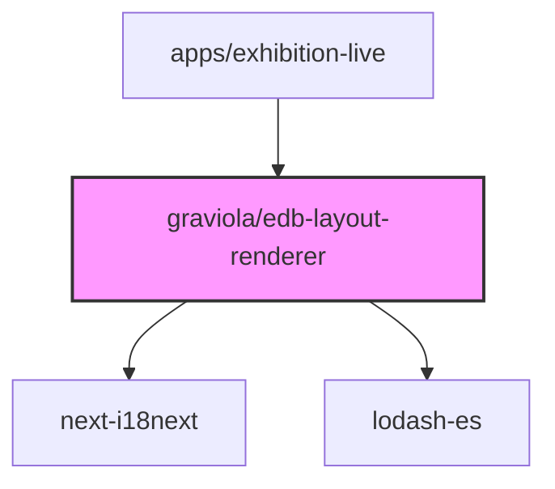

# @graviola/edb-layout-renderer

Advanced layout renderers for JSON Forms in the Graviola framework, providing structured and navigable form layouts.


## Overview

This package provides specialized layout renderers for JSON Forms that enhance the user experience when working with complex form structures. It includes renderers for handling anyOf schemas with tabs, categorization layouts with step-by-step navigation, and utilities for working with combinator properties.

## Ecosystem Integration

### Position in the Graviola Framework

The layout-renderer package is a core UI component in the Graviola framework's form rendering system. It provides higher-level layout components that organize form content in a structured and navigable way, making complex forms more manageable. It works alongside other form renderer packages to create rich, interactive forms for editing linked data.

### Dependency Graph



### Package Relationships

- **Dependencies**:

  - `next-i18next`: Used for internationalization of labels and messages
  - `lodash-es`: Provides utility functions for object manipulation

- **Peer Dependencies**:

  - `@mui/material`, `@mui/icons-material`: Material UI components
  - `@jsonforms/material-renderers`, `@jsonforms/core`, `@jsonforms/react`: JSON Forms library
  - `react`: React library

- **Used By**:
  - `apps/exhibition-live`: Uses the layout renderers in its form configuration and TypedForm component

## Installation

```bash
bun add @graviola/edb-layout-renderer
# or
npm install @graviola/edb-layout-renderer
# or
yarn add @graviola/edb-layout-renderer
```

## Features

- **MaterialCustomAnyOfRenderer**: Renders anyOf schemas as tabs, allowing users to switch between different schema options
- **MaterialCategorizationStepperLayout**: Renders categorization layouts as a step-by-step form with navigation buttons
- **CombinatorProperties**: Utility component for rendering properties of combinator schemas

## Usage

### MaterialCustomAnyOfRenderer

The MaterialCustomAnyOfRenderer displays anyOf schemas as tabs, making it easy for users to switch between different schema options:

```typescript
import {
  materialCustomAnyOfControlTester,
  MaterialCustomAnyOfRenderer
} from '@graviola/edb-layout-renderer';
import { JsonFormsRendererRegistryEntry } from '@jsonforms/core';

// Create a renderer registry
const renderers: JsonFormsRendererRegistryEntry[] = [
  // Register the custom anyOf renderer
  {
    tester: materialCustomAnyOfControlTester,
    renderer: MaterialCustomAnyOfRenderer
  }
];

// Use the renderers with JsonForms
import { JsonForms } from '@jsonforms/react';

const MyForm = ({ data, schema, uischema, onChange }) => (
  <JsonForms
    data={data}
    schema={schema}
    uischema={uischema}
    renderers={renderers}
    onChange={onChange}
  />
);
```

### MaterialCategorizationStepperLayout

The MaterialCategorizationStepperLayout renders categorization layouts as a step-by-step form with navigation buttons:

```typescript
import {
  MaterialCategorizationStepperLayoutRegistryEntry
} from '@graviola/edb-layout-renderer';
import { JsonFormsRendererRegistryEntry } from '@jsonforms/core';

// Create a renderer registry with the categorization stepper layout
const renderers: JsonFormsRendererRegistryEntry[] = [
  // Register the categorization stepper layout
  MaterialCategorizationStepperLayoutRegistryEntry
];

// Use the renderers with JsonForms
import { JsonForms } from '@jsonforms/react';

const MyForm = ({ data, schema, uischema, onChange }) => (
  <JsonForms
    data={data}
    schema={schema}
    uischema={uischema}
    renderers={renderers}
    onChange={onChange}
  />
);
```

### Categorization UI Schema Example

To use the categorization stepper layout, you need to define a UI schema with a Categorization element:

```json
{
  "type": "Categorization",
  "options": {
    "variant": "stepper",
    "showNavButtons": true
  },
  "elements": [
    {
      "type": "Category",
      "label": "Basic Information",
      "elements": [
        {
          "type": "Control",
          "scope": "#/properties/name"
        },
        {
          "type": "Control",
          "scope": "#/properties/description"
        }
      ]
    },
    {
      "type": "Category",
      "label": "Additional Details",
      "elements": [
        {
          "type": "Control",
          "scope": "#/properties/startDate"
        },
        {
          "type": "Control",
          "scope": "#/properties/endDate"
        }
      ]
    }
  ]
}
```

## Internal Usage

This package is used in the Graviola framework to render complex form layouts in applications like the exhibition-live app. Here's an example from the TypedForm.tsx file:

```typescript
// From apps/exhibition-live/components/content/main/TypedForm.tsx
import { MaterialCategorizationStepperLayoutRegistryEntry } from "@graviola/edb-layout-renderer";

// ...

const mainFormRenderers = useMemo(() => {
  return [
    MaterialCategorizationStepperLayoutRegistryEntry,
  ];
}, []);

// ...

return (
  <SemanticJsonForm
    // other props...
    jsonFormsProps={{
      uischema,
      renderers: mainFormRenderers,
      config: {
        useCRUDHook: useCRUDWithQueryClient,
        debug: enableDebug,
      },
    }}
  />
);
```

And in the renderer registry:

```typescript
// From apps/exhibition-live/components/config/rendererRegistry.ts
import {
  materialCustomAnyOfControlTester,
  MaterialCustomAnyOfRenderer,
} from "@graviola/edb-layout-renderer";

export const rendererRegistry: JsonFormsRendererRegistryEntry[] = [
  ...materialRenderers,
  {
    tester: materialCustomAnyOfControlTester,
    renderer: MaterialCustomAnyOfRenderer,
  },
  // other renderers...
];
```

## API Reference

### MaterialCustomAnyOfRenderer

A renderer for anyOf schema constructs, displaying them as tabs.

### materialCustomAnyOfControlTester

A tester function that determines if the MaterialCustomAnyOfRenderer should be used for a given UI schema element.

### MaterialCategorizationStepperLayout

A renderer for categorization layouts with a stepper UI, providing step-by-step navigation through form categories.

### CombinatorProperties

A utility component for rendering properties of combinator schemas.

## License

This package is part of the Graviola project.
