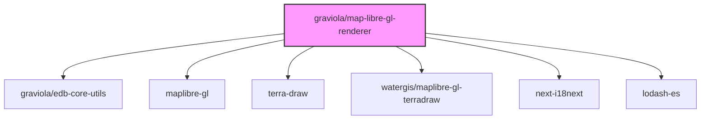

# @graviola/map-libre-gl-renderer

JSON Forms renderers for integrating MapLibre GL maps into forms within the Graviola framework.


## Overview

This package provides specialized JSON Forms renderers and components for working with geographic data in forms. It integrates MapLibre GL JS, an open-source map rendering library, with JSON Forms to enable interactive map-based inputs and visualizations.

## Ecosystem Integration

### Position in the Graviola Framework

The map-libre-gl-renderer package extends the form rendering capabilities of the Graviola framework by providing specialized components for geographic data. It enables users to select points on a map, draw geometric shapes, and visualize geographic information directly within forms.

### Dependency Graph



### Package Relationships

- **Dependencies**:

  - `@graviola/edb-core-utils`: Provides utility functions
  - `maplibre-gl`: Open-source map rendering library
  - `terra-draw`: Drawing library for geographic features
  - `@watergis/maplibre-gl-terradraw`: MapLibre GL integration for Terra Draw
  - `next-i18next`: Used for internationalization
  - `lodash-es`: Provides utility functions

- **Peer Dependencies**:
  - `@graviola/edb-state-hooks`: For state management
  - `@mui/material`, `@mui/icons-material`: Material UI components
  - `@jsonforms/material-renderers`, `@jsonforms/core`, `@jsonforms/react`: JSON Forms library
  - `react`: React library

## Installation

```bash
bun add @graviola/map-libre-gl-renderer
# or
npm install @graviola/map-libre-gl-renderer
# or
yarn add @graviola/map-libre-gl-renderer
```

## Features

- **MapLibreGlRenderer**: A JSON Forms renderer for geographic point data in WKT format (e.g., "POINT(longitude latitude)")
- **MapLibreComponent**: A React component for rendering MapLibre GL maps with point selection
- **TerradrawMapComponent**: A React component for drawing and editing geographic features (points, lines, polygons, etc.)
- **OpenStreetMap Integration**: Uses OpenStreetMap tiles as the default base map
- **Interactive Map Controls**: Includes navigation controls, zoom, and pan functionality
- **Geometry Drawing Tools**: Support for drawing points, lines, polygons, rectangles, circles, and more

## Usage

### Basic Usage with MapLibreGlRenderer

To use the MapLibreGlRenderer in your JSON Forms application:

```typescript
import {
  MapLibreGlRenderer,
  MapLibreGlRendererTester
} from '@graviola/map-libre-gl-renderer';
import { JsonFormsRendererRegistryEntry } from '@jsonforms/core';

// Create a renderer registry
const renderers: JsonFormsRendererRegistryEntry[] = [
  // Register the MapLibre GL renderer
  {
    tester: MapLibreGlRendererTester,
    renderer: MapLibreGlRenderer
  }
];

// Use the renderers with JsonForms
import { JsonForms } from '@jsonforms/react';

const MyForm = ({ data, schema, uischema, onChange }) => (
  <JsonForms
    data={data}
    schema={schema}
    uischema={uischema}
    renderers={renderers}
    onChange={onChange}
  />
);
```

### JSON Schema Example for Geographic Point

```json
{
  "type": "object",
  "properties": {
    "name": {
      "type": "string",
      "title": "Name"
    },
    "location": {
      "type": "string",
      "title": "Location",
      "description": "Geographic point in WKT format"
    }
  }
}
```

### UI Schema Example

```json
{
  "type": "VerticalLayout",
  "elements": [
    {
      "type": "Control",
      "scope": "#/properties/name"
    },
    {
      "type": "Control",
      "scope": "#/properties/location",
      "options": {
        "format": "map"
      }
    }
  ]
}
```

### Using MapLibreComponent Directly

You can also use the MapLibreComponent directly in your React components:

```tsx
import { MapLibreComponent } from "@graviola/map-libre-gl-renderer";
import React, { useState } from "react";

const MyMapComponent = () => {
  const [selectedPoint, setSelectedPoint] = useState<[number, number] | null>(
    null,
  );

  const handlePointPicked = (point: [number, number]) => {
    setSelectedPoint(point);
    console.log(`Selected point: POINT(${point[0]} ${point[1]})`);
  };

  return (
    <MapLibreComponent
      initialCenter={[0, 0]}
      initialZoom={3}
      onPointPicked={handlePointPicked}
      selectedPoint={selectedPoint}
    />
  );
};
```

### Using TerradrawMapComponent for Drawing Features

For more advanced drawing capabilities:

```tsx
import { TerradrawMapComponent } from "@graviola/map-libre-gl-renderer";
import React, { useState } from "react";
import type { GeoJSONStoreFeatures } from "terra-draw/dist/store/store";

const MyDrawingComponent = () => {
  const [features, setFeatures] = useState<GeoJSONStoreFeatures[]>([]);

  const handleFeaturesCreated = (newFeatures: GeoJSONStoreFeatures[]) => {
    setFeatures([...features, ...newFeatures]);
    console.log("Features created:", newFeatures);
  };

  return (
    <TerradrawMapComponent
      initialCenter={[0, 0]}
      initialZoom={3}
      features={features}
      onFeaturesCreated={handleFeaturesCreated}
    />
  );
};
```

## API Reference

### MapLibreGlRenderer

A JSON Forms renderer for geographic point data in WKT format.

#### Props

Inherits all props from JSON Forms ControlProps.

### MapLibreComponent

A React component for rendering MapLibre GL maps with point selection.

#### Props

- `initialCenter?: [number, number]`: Initial center coordinates [longitude, latitude]
- `initialZoom?: number`: Initial zoom level
- `onPointPicked?: (point: [number, number]) => void`: Callback when a point is picked on the map
- `selectedPoint?: [number, number]`: Currently selected point [longitude, latitude]
- `onMapCreated?: (map: maplibregl.Map) => void`: Callback when the map is created

### TerradrawMapComponent

A React component for drawing and editing geographic features.

#### Props

- `initialCenter?: [number, number]`: Initial center coordinates [longitude, latitude]
- `initialZoom?: number`: Initial zoom level
- `features?: GeoJSONStoreFeatures[]`: Features to display on the map
- `editFeatures?: GeoJSONStoreFeatures[]`: Features to edit
- `onFeaturesCreated?: (features: GeoJSONStoreFeatures[]) => void`: Callback when features are created
- `onFeatureSelected?: (id: FeatureId) => void`: Callback when a feature is selected
- `onFeatureDeleted?: (ids: FeatureId[], type: string, context?: OnChangeContext) => void`: Callback when features are deleted

## License

This package is part of the Graviola project.
