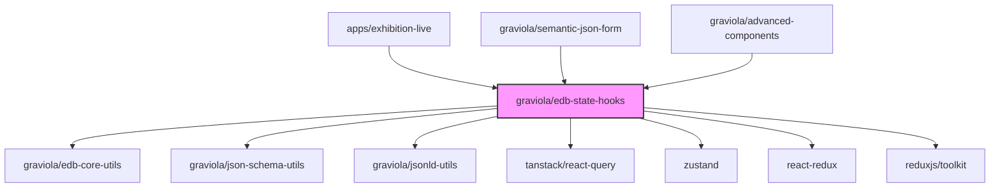

# @graviola/edb-state-hooks

React hooks for state management in the Graviola framework.


## Overview

This package provides a collection of React hooks for state management, data fetching, and UI control in the Graviola framework. It integrates with React Query (TanStack Query) for efficient data fetching and caching, and provides hooks for form data management, CRUD operations, global search, and more.

## Ecosystem Integration

### Position in the Graviola Framework

The state-hooks package is a core component of the Graviola framework's client-side architecture. It provides the state management layer that connects the UI components with the data layer, enabling reactive updates and efficient data operations. This package is essential for applications that need to manage state, fetch data from APIs, and provide a responsive user experience.

### Dependency Graph



### Package Relationships

- **Dependencies**:

  - `@graviola/edb-core-utils`: Provides utility functions
  - `@graviola/json-schema-utils`: Provides utilities for working with JSON Schema
  - `@graviola/jsonld-utils`: Provides utilities for working with JSON-LD data
  - `lodash-es`: Provides utility functions

- **Peer Dependencies**:

  - `@tanstack/react-query`: For data fetching and caching
  - `zustand`: For state management
  - `react-redux`: For Redux integration
  - `@reduxjs/toolkit`: For Redux utilities
  - `@ebay/nice-modal-react`: For modal management
  - `react`: React library

- **Used By**:
  - `apps/exhibition-live`: Uses the hooks for state management and data operations
  - `@graviola/semantic-json-form`: Uses the hooks for form state management
  - `@graviola/advanced-components`: Uses the hooks for component state management

## Installation

```bash
bun add @graviola/edb-state-hooks
# or
npm install @graviola/edb-state-hooks
# or
yarn add @graviola/edb-state-hooks
```

## Features

### Data Fetching and Caching

- **React Query Integration**: Exports React Query hooks and providers for efficient data fetching and caching
- **useCRUDWithQueryClient**: Hook for CRUD operations with React Query integration
- **useQuery**: Hook for data fetching with caching and automatic refetching
- **useMutation**: Hook for data mutations with automatic cache invalidation

### Form Management

- **useFormData**: Hook for managing form data with Zustand
- **useFormDataStore**: Hook for managing form data with redux
- **useFormEditor**: Hook for form editing state management

### Navigation and Routing

- **useModifiedRouter**: Hook for enhanced router functionality
- **useLocalHistory**: Hook for managing local navigation history

### UI State Management

- **useRightDrawerState**: Hook for managing the state of the right drawer
- **useGlobalSearch**: Hook for global search functionality
- **useSimilarityFinderState**: Hook for managing similarity finder state
- **useModalRegistry**: Hook for managing modal state

### Context and Configuration

- **useAdbContext**: Hook for accessing the ADB context
- **useGlobalCRUDOptions**: Hook for accessing global CRUD options
- **useExtendedSchema**: Hook for extending JSON Schema with additional information

## Usage

### Basic Setup

```tsx
import {
  QueryClient,
  QueryClientProvider,
  AdbProvider,
  store,
} from "@graviola/edb-state-hooks";
import { Provider } from "react-redux";
import React from "react";

// Create a query client
const queryClient = new QueryClient();

// Set up your application with the necessary providers
const App = () => (
  <Provider store={store}>
    <QueryClientProvider client={queryClient}>
      <AdbProvider
        typeNameToTypeIRI={(typeName) =>
          `http://example.org/ontology#${typeName}`
        }
        typeIRItoTypeName={(typeIRI) =>
          typeIRI.replace("http://example.org/ontology#", "")
        }
        createEntityIRI={(typeName) =>
          `http://example.org/entity/${typeName}/${Date.now()}`
        }
        jsonLDConfig={{
          defaultPrefix: "http://example.org/",
          jsonldContext: {
            "@vocab": "http://example.org/",
          },
        }}
      >
        <YourApp />
      </AdbProvider>
    </QueryClientProvider>
  </Provider>
);
```

### Data Fetching with useCRUDWithQueryClient

```tsx
import {
  useCRUDWithQueryClient,
  useAdbContext,
} from "@graviola/edb-state-hooks";
import { JSONSchema7 } from "json-schema";
import React from "react";

// Define your schema
const schema: JSONSchema7 = {
  type: "object",
  properties: {
    name: { type: "string" },
    description: { type: "string" },
  },
  required: ["name"],
};

const EntityEditor = ({ entityIRI, typeIRI }) => {
  // Use the CRUD hook
  const { loadQuery, saveMutation, removeMutation } = useCRUDWithQueryClient({
    entityIRI,
    typeIRI,
    schema,
    queryOptions: { enabled: true },
  });

  // Get the data from the query
  const { data, isLoading, error } = loadQuery;

  // Handle save
  const handleSave = (formData) => {
    saveMutation.mutate(formData);
  };

  // Handle remove
  const handleRemove = () => {
    removeMutation.mutate();
  };

  if (isLoading) return <div>Loading...</div>;
  if (error) return <div>Error: {error.message}</div>;

  return (
    <div>
      <pre>{JSON.stringify(data?.document, null, 2)}</pre>
      <button onClick={handleSave}>Save</button>
      <button onClick={handleRemove}>Remove</button>
    </div>
  );
};
```

### Form Data Management

```tsx
import { useFormDataStore } from "@graviola/edb-state-hooks";
import React from "react";

const FormComponent = ({ entityIRI, typeIRI }) => {
  // Use the form data store
  const { formData, setFormData } = useFormDataStore({
    entityIRI,
    typeIRI,
    autoCreateNewEntityIRI: true,
  });

  // Handle form changes
  const handleChange = (field, value) => {
    setFormData({
      ...formData,
      [field]: value,
    });
  };

  return (
    <form>
      <input
        type="text"
        value={formData.name || ""}
        onChange={(e) => handleChange("name", e.target.value)}
      />
      <textarea
        value={formData.description || ""}
        onChange={(e) => handleChange("description", e.target.value)}
      />
    </form>
  );
};
```

### Global Search

```tsx
import { useGlobalSearch } from "@graviola/edb-state-hooks";
import React from "react";

const SearchComponent = () => {
  // Use the global search hook
  const { search, setSearch } = useGlobalSearch();

  return (
    <input
      type="text"
      value={search}
      onChange={(e) => setSearch(e.target.value)}
      placeholder="Search..."
    />
  );
};
```

### Right Drawer State

```tsx
import { useRightDrawerState } from "@graviola/edb-state-hooks";
import React from "react";

const DrawerComponent = () => {
  // Use the right drawer state hook
  const { open, width, setOpen, setWidth } = useRightDrawerState();

  return (
    <div>
      <button onClick={() => setOpen(!open)}>
        {open ? "Close Drawer" : "Open Drawer"}
      </button>
      {open && (
        <div style={{ width }}>
          <input
            type="range"
            min="200"
            max="600"
            value={width}
            onChange={(e) => setWidth(Number(e.target.value))}
          />
          <div>Drawer Content</div>
        </div>
      )}
    </div>
  );
};
```

## Internal Usage

This package is used throughout the Graviola framework for state management and data operations. Here are some examples from the exhibition-live app:

```tsx
// From apps/exhibition-live/components/content/main/TypedForm.tsx
import {
  useAdbContext,
  useFormEditor,
  useGlobalSearch,
  useModifiedRouter,
  useRightDrawerState,
  useExtendedSchema,
  useFormDataStore,
  useCRUDWithQueryClient,
} from "@graviola/edb-state-hooks";

const TypedForm = ({ typeName, entityIRI, classIRI }) => {
  const {
    typeIRIToTypeName,
    jsonLDConfig: { defaultPrefix, jsonldContext },
    uischemata,
  } = useAdbContext();

  const { formData, setFormData } = useFormDataStore({
    entityIRI,
    typeIRI: classIRI,
  });

  const { search: searchText } = useGlobalSearch();
  const router = useModifiedRouter();
  const loadedSchema = useExtendedSchema({ typeName });

  // ... rest of the component
};
```

```tsx
// From apps/exhibition-live/components/content/main/Dashboard.tsx
import { useQuery } from "@graviola/edb-state-hooks";
import { useAdbContext, useGlobalCRUDOptions } from "@graviola/edb-state-hooks";

const Dashboard = () => {
  const { dataStore } = useAdbContext();
  const { sparqlEndpoint } = useGlobalCRUDOptions();

  const { data, isLoading } = useQuery({
    queryKey: ["dashboard-stats"],
    queryFn: async () => {
      // Fetch dashboard statistics
      return await dataStore.fetchStatistics();
    },
  });

  // ... rest of the component
};
```

## API Reference

### Data Fetching and Caching

#### useCRUDWithQueryClient

A hook for CRUD operations with React Query integration.

```typescript
const {
  loadQuery,
  existsQuery,
  saveMutation,
  removeMutation,
  loadEntity
} = useCRUDWithQueryClient({
  entityIRI: string,
  typeIRI: string,
  queryOptions?: QueryOptions,
  loadQueryKey?: string,
  allowUnsafeSourceIRIs?: boolean
});
```

### Form Management

#### useFormDataStore

A hook for managing form data with entity and type information.

```typescript
const {
  formData,
  setFormData
} = useFormDataStore({
  entityIRI?: string,
  typeIRI: string,
  createNewEntityIRI?: () => string,
  autoCreateNewEntityIRI?: boolean
});
```

### Context and Configuration

#### useAdbContext

A hook for accessing the ADB context.

```typescript
const {
  typeNameToTypeIRI,
  typeIRIToTypeName,
  createEntityIRI,
  jsonLDConfig,
  uischemata,
  dataStore,
  queryBuildOptions,
} = useAdbContext();
```

## License

This package is part of the Graviola project.
